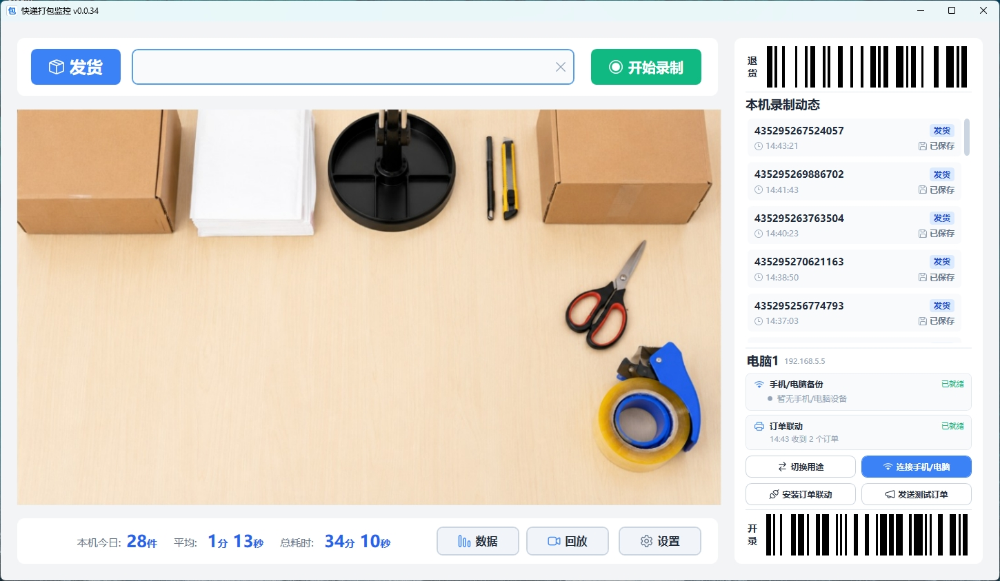
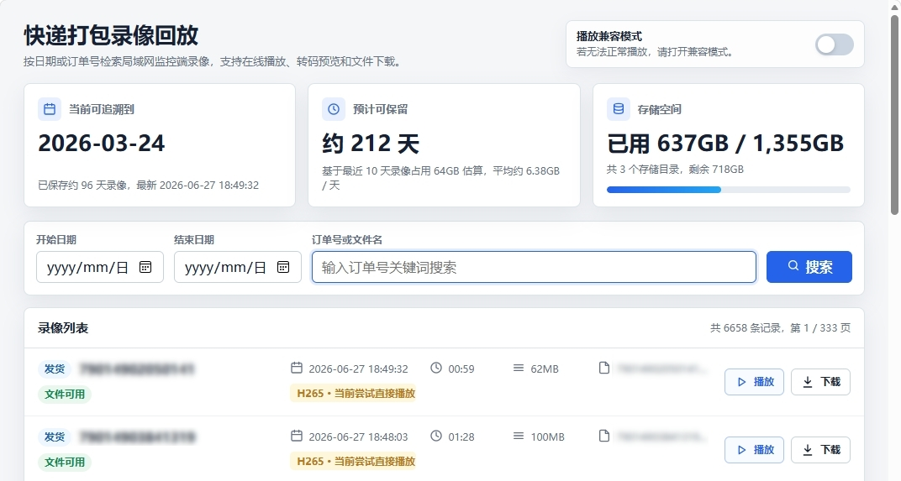

#  快递打包监控

简体中文 | [English](README.en.md)

面向电商卖家和打包场景的录像与发货风险拦截工具。扫码自动录像，联动快递助手播报买家留言和卖家备注；面单打印后发生退款，也能在发货前及时报警拦截

> 不只在售后提供录像证据，也在打包过程中提醒特殊要求、拦截退款订单，减少错发、漏发和退款后发货

## 适合谁用

- 使用快递助手打印面单，希望直接联动现有工作流程。
- 担心面单打印后订单发生退款，仍被打包发出。
- 需要在打包时播报买家留言、卖家备注或商品信息。
- 想扫码自动录像，并按快递单号快速找到对应录像。
- 想集中备份手机或其他录制电脑的录像，并在局域网里查看。
- 想在网页端剪掉录像开头或结尾后再下载。
- 磁盘空间有限，希望旧录像能自动清理，同时给系统保留空间。

## 主要功能

- 联动快递助手同步订单，在打包时语音播报买家留言、卖家备注和商品信息。
- 扫码后异步核验打印后退款，发货和退货模式均可按退款状态报警，且不影响录像。
- 摄像头可自动识别面单一维条形码并开始录像，将打包过程与快递单号关联。
- 主画面中央引导框用于稳定识别；未录像时会低频检查全画面，录像中只识别引导框，降低商品条码误触风险。
- 扫码枪与摄像头识别可以同时使用，扫码枪继续作为后台扫码和故障后备方案。
- 支持摄像头录制、声音录制和录像水印。
- 通过单页两问选择四种电脑用途：电脑录像并保存在本机、电脑录像并保存到其他电脑、录像文件备份主机、只连接主机查看。
- 录制工位未绑定或保存主机离线时仍可录像；文件先进入本地安全缓存，绑定或恢复联网后自动补传，只有保存主机确认完整接收的文件才会参与缓存清理。
- 录像文件备份主机可集中接收手机和其他录制电脑上传的录像，并提供局域网回放。
- 录像列表可按单号搜索，也可通过网页回放。
- 网页端支持“剪辑并下载”，可选择保留的时间范围。
- 本机长期录像支持多个保存位置，并按预留空间规则自动切换磁盘和清理旧录像；录制工位使用单一缓存位置和独立缓存上限。
- 支持启动器自动检查更新，下载并校验 AppPatch 后在下次启动时自动安装；AppPatch 和 LauncherPatch 完整解压后也可双击包内脚本手动更新。

## 需要准备

- Windows 10/11 x64 电脑
- USB 摄像头
- 键盘模式的扫码枪（可选，建议保留作后备）

推荐下载 `PackingProof_Setup_vX.Y.Z.exe` 安装向导。安装器无需管理员权限，会固定安装到当前用户目录并创建开始菜单快捷方式，桌面快捷方式默认勾选。完整 7z 是体积更小的免安装包，完整 ZIP 用于 Windows 原生解压和故障恢复。发布包通常都不需要额外安装 `.NET` 和 `ffmpeg.exe`；从源码运行或二次开发需要安装 `.NET 8 SDK` 和 `ffmpeg.exe`（推荐使用 Essentials 版本）

## 快速开始

1. 首次启动时选择这台电脑的用途。
2. 使用电脑录像时，按向导配置摄像头、麦克风和录像保存或缓存位置。
3. 选择“电脑录像并保存到其他电脑”时可先开始录像，再搜索或扫码绑定保存主机；选择“录像文件备份主机”时可连接手机或其他录制电脑。
4. 将面单条形码放入主画面引导框，稳定识别后自动开始录像；也可以继续使用扫码枪。
5. 发货或扫描停止指令后结束录像。
6. 需要查看时，在录像列表里输入快递单号搜索。

摄像头休眠默认关闭。如在高级设置中主动开启，休眠后请先点击软件、按键或使用扫码枪唤醒摄像头，再将面单放入识别框。

## 软件更新

- 日常使用请从安装器创建的快捷方式或安装根目录的 `ExpressPackingMonitoring.exe` 启动。启动器会在后台下载经过校验的增量包，并在下次启动时自动安装。
- 手动更新主程序时，下载 `ExpressPackingMonitoring_AppPatch_vX.Y.Z.zip`，完整解压后双击 `双击更新主程序.cmd`。脚本会校验补丁、识别原安装位置并在失败时回滚，不会删除配置、数据库或录像。
- 手动更新根目录启动器时，下载 `PackingProof_LauncherPatch_vX.Y.Z.zip`，完整解压后双击 `双击更新启动器.cmd`。脚本只替换根目录入口，并保留经验证的旧启动器备份；正常自动更新无需手动下载这两个补丁。
- 如果增量包提示安装版本低于补丁基线，请优先运行新版 Setup 原位覆盖升级，也可使用完整 ZIP 故障恢复。旧免安装目录不会自动迁移或删除；不要删除 `%LOCALAPPDATA%\ExpressPackingMonitoring\`，配置、数据库和录像记录会继续保留。

## 卸载与数据

- 卸载时会在一个窗口中提供“删除设置和临时文件”“删除录像和录像记录”两个选项，默认均不勾选。
- 设置清理只删除配置、日志和缓存，不包含录像、录像数据库或数据库恢复备份。
- 录像清理只处理数据库登记且确认后没有变化的精确文件；全部录像删除成功后，才会继续删除录像数据库及其恢复备份。
- 数据库缺失、损坏、占用或任何录像清理失败时，数据库和其余应用数据会保留，详情记录在系统临时目录的卸载日志中。

## 局域网回放

1. 使用“电脑录像并保存在本机”或“录像文件备份主机”用途启动 Web 服务。
2. 在“连接手机/电脑”窗口扫描录像网页二维码，或在同一局域网设备访问窗口显示的地址。
3. Android 手机可扫描独立的 App 下载二维码；手机浏览器页面顶部也提供下载入口。

如果系统弹出防火墙提示，请允许访问。

## 订单备注播报

需要配合浏览器脚本使用：

1. 安装 Tampermonkey 或 Violentmonkey。
2. 在程序中点击“安装订单联动”，按安装向导安装脚本。
3. 打印页面打开或订单变化时，脚本会自动把当前订单信息发送给监控端，不需要保持退款工作页供普通订单使用。
4. 监控端收到订单后，可播报备注和商品信息。
5. 如需打印后退款报警，请保持一个已登录的快递助手批量打印页面打开。脚本会在后台打开不抢焦点的“退款核验工作页”，只有该专用页面会切换“打印后退款”筛选，用户正在操作的打印页面不会被切换。
6. 监控端扫码后会立即录像并异步请求退款数据。工作页先回传当前退款列表；目标单号不在列表中时，再按快递单号精确查询历史订单。查询失败或打印端暂时离线时，监控端使用 SQLite 中最近 90 天的订单数据降级核验。

退款核验工作页有专用标题和半透明遮罩，请勿在该页面手动操作；误关后脚本会自动重建，也可从扩展菜单手动打开。脚本首次连接新的监控端地址时，如果浏览器询问跨源访问权限，应确认目标地址是本机或可信局域网内的录像服务后再允许；从本机安装向导重新安装脚本，可自动加入当前服务的精确访问权限。

重复单号从录像数据库中检查最近 30 天的未删除记录，不依赖浏览器订单缓存。订单及退款缓存也统一保存在 SQLite 中，旧的 `orderinfo_cache.json` 仅在升级时迁移，迁移完成后会删除。

## 录像保存

软件会把配置、数据库、日志和录像保存在本机用户数据目录中。升级软件时，只要不删除用户数据，原来的配置和录像记录会继续保留。

长期保存用途的存储管理设置的是“预留空间”：磁盘低于这个剩余空间时，软件会停止往该磁盘继续写入新录像，并优先切换到下一个保存位置。系统盘会自动保留更高的安全空间，避免影响 Windows 和其他软件运行。

“电脑录像并保存到其他电脑”使用本地缓存：默认上限为 100 GB，但不会预占空间，实际可安全使用容量会同时受磁盘真实剩余空间和最低预留空间限制。空间不足时只会按时间清理已经由保存主机确认完整接收的录像；未绑定、待上传、上传中或失败的录像不会自动删除。

## 许可证

本项目使用 [AGPL-3.0 License](LICENSE) 开源。

个人学习、自家店铺自用可以免费使用；如果修改后对外分发或提供网络服务，需要遵守 AGPL-3.0 的开源要求。

