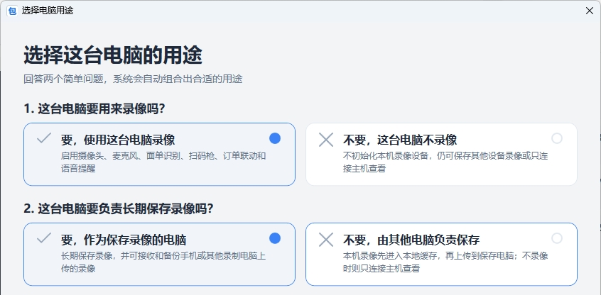

<div align="center">


# PackingProof

**开源免费的快递打包录像与发货风险拦截工具**

扫码自动录像，按快递单号保存。
支持订单备注播报、打印后退款拦截，以及手机与电脑多工位集中备份。

<br>

<a href="https://github.com/PackingProof/PackingProof-Desktop/releases/latest">
  
</a>
&nbsp;
<a href="https://github.com/PackingProof/PackingProof-Mobile/releases/latest">
  
</a>
&nbsp;
<a href="https://testflight.apple.com/join/KR4qNs6t">
  
</a>

<br><br>

[简体中文](README.md) · [English](README.en.md)

<br>

[](https://github.com/PackingProof/PackingProof-Desktop)
[](https://github.com/PackingProof/PackingProof-Desktop/releases)
[](LICENSE)

</div>

手机版同时支持 Android 与 iOS：Android 可下载 ARM64 正式签名 APK；iOS 请先安装 TestFlight，再点击上方链接加入内测。

<br>


---

## 为什么需要 PackingProof

普通监控只能证明“包裹曾经被打包过”，却很难快速找到某一个订单对应的视频。

PackingProof 将**快递单号、订单信息和打包录像关联起来**：

> 扫描面单后自动开始录像，打包完成后结束录像并保存。
> 售后需要核实时，输入快递单号即可找到对应视频。

它不仅用于售后取证，也能在打包过程中播报特殊要求、提醒重复单号，并拦截已经退款但仍准备发出的订单。

## 核心功能

<table>
<tr>
<td width="50%" valign="top">

### 扫码自动录像

摄像头识别面单条形码后自动开始录像，并按快递单号保存。

同时支持键盘模式扫码枪，可作为日常输入方式或摄像头识别的后备方案。

</td>
<td width="50%" valign="top">

### 订单信息播报

联动快递助手，在打包时自动播报：

* 买家留言
* 卖家备注
* 商品信息

减少漏看备注、错发商品等问题。

</td>
</tr>
<tr>
<td width="50%" valign="top">

### 打印后退款拦截

面单打印后如果订单发生退款，PackingProof 会在打包扫码时进行提醒。

退款核验异步执行，不会影响正常开始录像。

</td>
<td width="50%" valign="top">

### 手机与电脑多工位

一台电脑可以作为录像保存主机，集中接收：

* Android 手机录像
* 其他电脑工位录像
* 本机摄像头录像

所有录像都可以在局域网内统一查找和回放。

录像文件备份主机还可以将录像归档到 NAS 或网络共享，NAS 满时自动切换备份位置。

</td>
</tr>
</table>

## QQ 机器人查询录像

[PackingProof QQBot](https://github.com/PackingProof/PackingProof-QQBot) 是基于本项目扩展 API 的独立参考实现。连接后，客服或同事可以在 QQ 私聊或已授权的 QQ 群中发送快递单号，由机器人查询 PackingProof 录像、回复录像时间与大小，并将视频直接发回 QQ。

QQBot 不读取数据库、录像目录或 NAS 凭据，只通过用户授权的扩展 API 查询、下载录像和请求超限交付副本。机器人需要单独下载和运行，不包含在 PackingProof Desktop 安装包中。

## 工作流程

<div align="center">

**扫描面单**

↓

**自动开始录像**

↓

**播报订单备注并核验退款状态**

↓

**完成打包，结束录像**

↓

**通过快递单号搜索和回放**

</div>

摄像头识别和扫码枪可以同时使用，不需要改变原有打包习惯。

## 多工位使用方式

首次启动时，软件会通过两个简单问题，帮助你选择这台电脑的用途。



| 使用方式                     | 适合场景                             |
| ---------------------------- | ------------------------------------ |
| **电脑录像并保存在本机**     | 单个打包工位，录像长期保存在当前电脑 |
| **电脑录像并保存到其他电脑** | 多个电脑工位录像，统一上传到一台主机 |
| **录像文件备份主机**         | 集中接收手机和其他电脑上传的录像     |
| **只连接主机查看**           | 不参与录像，只用于搜索、回放和管理   |

录制工位没有绑定主机，或者主机暂时离线时，仍然可以继续录像。

视频会先保存在本地缓存中，主机恢复连接后自动补传。只有主机确认完整收到的文件，才会参与缓存自动清理。

## 快速开始

### 1. 准备设备

* Windows 10 或 Windows 11 x64 电脑
* 摄像头：支持 USB 或网络摄像头（RTSP/RTMP/HTTP 视频流）
* 麦克风，可选
* 键盘模式扫码枪，可选但推荐保留

### 2. 安装软件

推荐下载：

```text
PackingProof_Setup_vX.Y.Z.exe
```

安装器不需要管理员权限，会安装到当前用户目录，并创建开始菜单快捷方式。

### 3. 完成首次配置

首次启动后：

1. 选择这台电脑的用途。
2. 选择摄像头和麦克风。
3. 设置录像保存位置或缓存位置。
4. 根据需要连接录像保存主机。
5. 将面单条形码放入画面中央的识别框。
6. 完成打包后，使用主界面的停止按钮结束录像。

识别成功后，软件会自动开始录像。

### 4. 查找录像

打开录像列表，输入快递单号即可搜索对应录像。

也可以通过局域网页面，在手机或其他电脑上回放。

## 局域网回放

使用“电脑录像并保存在本机”或“录像文件备份主机”模式时，可以启动局域网 Web 服务。

1. 打开软件中的“连接手机/电脑”。
2. 使用手机扫描录像网页二维码。
3. 或在同一局域网设备中打开软件显示的地址。
4. 输入快递单号搜索和回放录像。

网页端还支持选择保留的时间范围，剪辑后再下载录像。

如果 Windows 弹出防火墙提示，请允许软件访问局域网。


## 订单备注播报与退款拦截

该功能需要配合浏览器用户脚本使用。

### 基本配置

1. 安装 Tampermonkey 或 Violentmonkey。
2. 在 PackingProof 中点击“安装订单联动”。
3. 按照向导安装软件提供的用户脚本。
4. 打开并登录快递助手打印页面。

打印页面中的订单发生变化时，脚本会将订单信息同步给 PackingProof。

如果要开发 ERP、称重设备或第三方油猴脚本，请参阅 [扩展接口与第三方脚本开发规范](docs/EXTENSION_API_V1.md)。

扫码开始打包后，软件可以播报买家留言、卖家备注和商品信息。

<details>
<summary><strong>展开查看退款核验说明</strong></summary>

<br>

如需使用打印后退款报警，请保持一个已经登录的快递助手批量打印页面打开。

用户脚本会在后台创建专用的退款核验工作页：

* 工作页不会抢占当前操作页面的焦点。
* 只有工作页会切换“打印后退款”筛选。
* 用户正在操作的打印页面不会被自动切换。
* 工作页有独立标题和半透明遮罩，请勿在其中手动操作。
* 误关工作页后，脚本会自动重新创建。

扫描快递单号后，PackingProof 会立即开始录像，并异步请求退款数据。

核验顺序为：

1. 检查当前打印后退款列表。
2. 如果没有找到目标单号，按快递单号精确查询历史订单。
3. 查询失败或打印端离线时，使用本机 SQLite 中最近 90 天的订单数据进行降级核验。

重复快递单号则根据录像数据库中最近 30 天的未删除记录进行检查，不依赖浏览器缓存。

</details>

用户脚本首次连接新的监控端地址时，浏览器可能询问跨源访问权限。请确认目标是本机或可信局域网内的 PackingProof 服务后再允许；通过软件中的安装向导重新安装脚本，可以加入当前服务所需的精确访问权限。

## 录像保存与缓存

长期保存模式可以配置多个录像保存位置。

录像文件备份主机还可以添加 NAS 或网络共享作为备份位置：

* 本地磁盘直接保存录像，网络位置只保存校验后的副本
* 按列表顺序备份，NAS 满时自动切换到下一个可用位置
* NAS 用于扩展本地录像的保存周期；NAS 空间不足时自动循环清理最旧的归档录像（记录保留可查）
* NAS 不可用不影响本地录像按容量策略循环；本地副本未经远端确认清理时会记录独立原因码

当一个磁盘的剩余空间低于预留值时，软件会：

1. 停止继续向该磁盘写入新录像。
2. 自动切换到下一个可用保存位置。
3. 根据设置清理较旧录像。
4. 为 Windows 系统盘保留额外安全空间。

“电脑录像并保存到其他电脑”模式使用独立的本地缓存。

默认缓存上限为 `100 GB`，但不会提前占用磁盘空间。

<details>
<summary><strong>展开查看缓存安全规则</strong></summary>

<br>

缓存实际可用容量同时受到以下条件限制：

* 设置的缓存容量上限
* 磁盘当前真实剩余空间
* 磁盘最低预留空间

空间不足时，只会清理已经由保存主机确认完整接收的录像。

以下文件不会被自动删除：

* 尚未绑定保存主机的录像
* 等待上传的录像
* 正在上传的录像
* 上传失败的录像
* 主机尚未确认完整接收的录像

</details>

## 下载包怎么选择

| 文件                                           | 用途                                    |
| ---------------------------------------------- | --------------------------------------- |
| `PackingProof_Setup_vX.Y.Z.exe`                | 推荐，大多数用户选择这个                |
| `PackingProof+vX.Y.Z.7z`                       | 体积较小的免安装版本                    |
| `PackingProof+vX.Y.Z.zip`                      | 可使用 Windows 原生解压，也适合故障恢复 |
| `PackingProof_AppPatch_vX.Y.Z.zip`             | 手动更新主程序（过渡期同时提供旧名兼容副本） |
| `PackingProof_LauncherPatch_vX.Y.Z.zip`        | 手动更新根目录启动器                    |

正式发布包通常已经包含运行所需的 .NET 运行时和 FFmpeg，不需要额外安装。

## 软件更新

日常使用时，请从以下入口启动：

* 安装器创建的开始菜单或桌面快捷方式
* 安装目录中的 `ExpressPackingMonitoring.exe`

启动器会在后台检查并下载经过校验的增量更新包，并在下次启动时自动安装。

<details>
<summary><strong>展开查看手动更新与故障恢复</strong></summary>

<br>

### 手动更新主程序

下载：

```text
PackingProof_AppPatch_vX.Y.Z.zip
```

完整解压后，双击：

```text
双击更新主程序.cmd
```

更新脚本会：

* 校验补丁文件
* 自动识别原安装位置
* 更新失败时进行回滚
* 保留配置、数据库和录像

### 手动更新启动器

下载：

```text
PackingProof_LauncherPatch_vX.Y.Z.zip
```

完整解压后，双击：

```text
双击更新启动器.cmd
```

脚本只替换根目录启动入口，并保留经过验证的旧启动器备份。

### 版本过旧

如果提示当前安装版本低于补丁基线，请下载新版 Setup 进行原位置覆盖安装。

也可以使用完整 ZIP 版本进行故障恢复。

请不要删除：

```text
%LOCALAPPDATA%\ExpressPackingMonitoring\
```

该目录中包含软件配置、数据库和录像记录。

</details>

## 卸载与数据保留

卸载软件时，会提供两个独立选项：

* 删除设置和临时文件
* 删除录像和录像记录

两个选项默认都不勾选。

因此，普通卸载默认不会删除用户配置、数据库或录像。

<details>
<summary><strong>展开查看录像删除规则</strong></summary>

<br>

设置清理只会删除：

* 软件配置
* 日志
* 临时缓存

不会删除录像、录像数据库或数据库恢复备份。

录像清理只会处理：

* 已经登记在数据库中的录像
* 删除确认后没有发生变化的精确文件

软件不会扫描并清空整个录像目录。

如果出现以下情况，录像和数据库会继续保留：

* 数据库缺失
* 数据库损坏
* 数据库被其他程序占用
* 任意录像删除失败

详细结果会记录在系统临时目录中的卸载日志里。

</details>

## 从源码运行

从源码运行或进行二次开发，需要准备：

* .NET 8 SDK
* FFmpeg
* Windows 10/11 x64

FFmpeg 正式发布包内置 4.4.1 Essentials（兼容 Win7 老显卡硬件编码）；选择 AV1 时会自动回退 H.265。高级用户可在 Win8+ 自行替换 `app\tools\ffmpeg.exe`，官方不保证支持。

```bash
git clone https://github.com/PackingProof/PackingProof-Desktop.git
cd PackingProof-Desktop
```

然后使用 Visual Studio、Rider 或 `dotnet` 命令打开并构建项目。

## 反馈与贡献

使用过程中遇到问题，或者有新的功能建议，可以提交 Issue：

[提交问题或建议](https://github.com/PackingProof/PackingProof-Desktop/issues)

欢迎参与测试、完善文档、提交代码或分享实际使用经验。

如果这个项目对你有帮助，也欢迎点一个 Star，让更多有需要的电商卖家看到它。

## 开源许可证与品牌

PackingProof 使用 [AGPL-3.0 License](LICENSE) 开源。

你可以根据许可证免费使用、学习和修改本项目。

如果修改后对外分发，或者将修改后的程序作为网络服务提供，需要遵守 AGPL-3.0 对应的源代码公开要求。

`PackingProof` 名称及官方应用图标属于项目品牌资产，不因源代码采用 AGPL-3.0 而授权第三方将其用于修改版的产品标识。公开发布修改版时，请使用不同的产品名称和图标，并明确标注“非官方修改版”；可以使用“基于 PackingProof 开发”说明来源。详见[品牌使用政策](BRAND_POLICY.md)。

---

<div align="center">


<br><br>

**让每一个包裹，都能快速找到对应的打包记录。**

</div>
