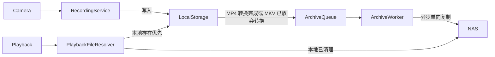
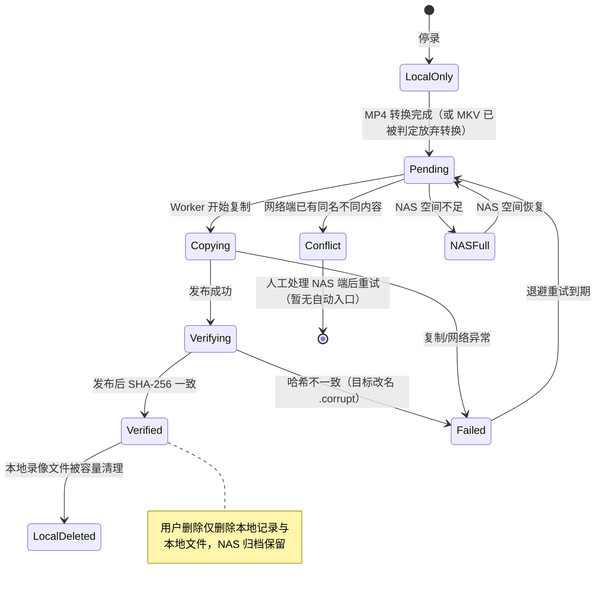
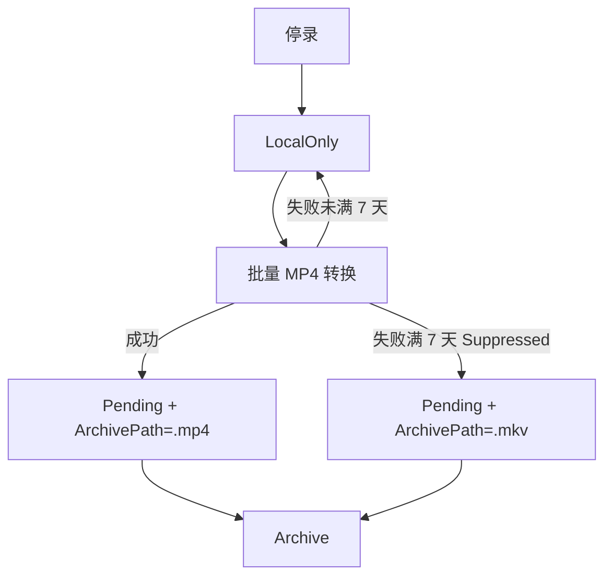
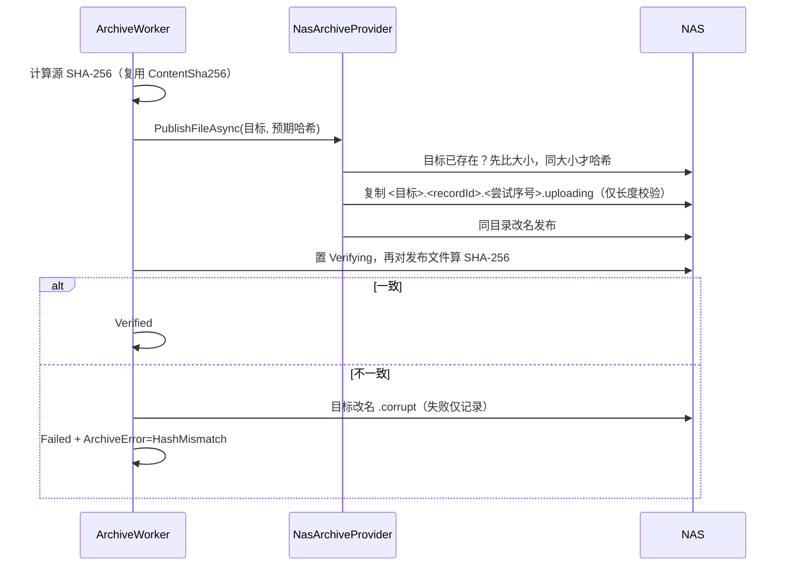

# NAS 单向归档架构说明

本文档描述“本地主录像存储 + NAS 单向归档”的存储模型、状态机与异常流程，供后续维护与贡献者参考。

## 1. 总体模型

- 录像进程直接写入现有存储管理选择的本地主存储目录（`WorkingRootPath`，当前录像主存储路径，非缓存）；网络路径绝不直接交给录像进程。
- NAS 只作为单向归档目标；从机/手机上传仍走 HTTP 到主机本地主存储，再由归档 Worker 异步复制。
- **支持多个网络备份位置**：按优先级选择当前可用（可达且空间高于预留值）的第一个作为归档目标；NAS 满时该记录自动改路到下一个可用位置，全部不可用时才进入 `NASFull` 暂停。
- 默认存储列表只含本地固定磁盘；网络位置必须由用户在“存储管理”手动添加（映射盘保存前归一化为 UNC）。
- **NAS 只上传、永不删除**：本地循环清理只删本地录像文件；用户删除录像也只删本地记录，NAS 归档文件生命周期独立于本地记录，由管理员通过 NAS 管理工具维护。程序不保证 NAS 文件与本地数据库永久一一对应（单向归档的设计行为，不是异常）。
- **NAS 空间状态只影响归档任务**：NAS 满时限频提示（60 分钟冷却），不影响本地录像、本地 GC 与硬循环保护机制。
- **NAS 采用单向归档模型**：NAS 文件仅由归档流程写入；所有归档状态（Pending/Verified/Conflict 等）由本地数据库维护，NAS 文件本身没有状态；ArchiveStatus 为弱一致状态，允许与 NAS 实际状态短暂或永久不一致。

## 2. 归档状态流转

- `LocalOnly`：录像已停止但尚未决定最终文件，**不进入归档队列**。
- `Pending`：最终文件已确定（MP4 转换成功，或 MKV 被 `MkvConversionRetryPolicy` 判定 Suppressed），等待归档。
- `Copying`/`Verifying`：断点续传优先；`Verifying` 是发布后的后台 SHA-256 校验状态。
- `Conflict`：NAS 已有同名但内容不同的文件，绝不覆盖；本地文件保留供人工比对，硬循环不删除 Conflict。
- `NASFull`：NAS 空间不足，归档暂停且不重试；空间恢复后自动回到 `Pending`。
- `Deleting`：旧版本遗留状态，新代码不再写入；`LocalDeleted` 表示本地录像文件已清理、记录保留：已备份（`ArchiveCompletedAt` 非空）的可通过 NAS 回放，未备份的仅保留清理痕迹（手动清理产生），不可回放。

## 3. 数据库字段与队列语义

归档队列 v1 直接使用 `VideoRecords` 上的状态字段（同一记录单目标，目标按可用性动态选择）：

| 字段 | 语义 |
| --- | --- |
| `ArchivePath` | 网络归档目标完整路径（UNC 优先） |
| `ArchiveStatus` | LocalOnly / Pending / Copying / Verifying / Verified / Failed / Conflict / NASFull / Deleting / LocalDeleted |
| `ArchiveRetryCount` / `NextRetryAt` | 失败退避（30s×2^n，上限 30 分钟） |
| `ArchiveError` | 最近一次错误（哈希失败为 `HashMismatch`） |
| `ArchiveCompletedAt` | 归档验证完成时间 |
| `LocalCopyDeletedAt` / `LocalDeleteReason` | 本地录像文件清理时间与原因 |
| `LastArchiveProbeAt` | GC 最近一次成功探测归档目标的时间；24 小时内免重复探测 |
| `DeleteReasonCode` | `UserRequested` / `CapacityCleanupVerified` / `CapacityCleanupUnarchived` / `CapacityEmergencyCleanupUnarchived` |
| `ContentSha256` | 归档校验哈希（发布后写入） |

队列查询：`GetPendingArchives` 按 Copying → Verifying → Pending（**EndTime 降序，新录像优先**）→ Failed（到期优先）排序；`NASFull` 不进入队列，由空间检查恢复后重新入队；队列为空时完成即唤醒可秒级归档刚结束的录像。NAS 恢复后新录像先归档，历史积压按批次上限自然限速补传。

`PendingDeleteAt` 列仅为旧数据库兼容保留，新代码完全不读写；`UserRequested` 仅表示用户请求删除本地记录，不代表删除 NAS 归档。

未来出现多归档目标（NAS + 云）时，拆独立 `ArchiveQueue` 表并按目标路由，`VideoRecords` 只保留状态摘要。

## 4. MKV/MP4 生命周期

- 转换成功：`UpdateVideoFilePath` 自动把 ArchivePath 从 `.mkv` 换成 `.mp4` 并置 Pending。
- 转换被 `MkvConversionRetryPolicy` 判定 Suppressed（首次失败超过 7 天）：`MarkArchivePendingByFilePath` 把 MKV 置 Pending。
- 正常路径 NAS 上只出现最终文件，不会 MKV/MP4 双份。
- 已知边例：用户手动强制转换（forceRetry）已归档 MKV 时，可能短暂出现 MKV/MP4 双份；不自动清理，需人工处理。
- 未找到 FFmpeg 时不做转换也不归档，记录保持 LocalOnly。
- **历史回填**：NAS 配置前已定稿的 MP4（含之后才完成转换的 MP4）由归档 Worker 自动补设 `ArchivePath` 并置 Pending（启动或唤醒时扫描，5 分钟间隔限制）；本地文件已不存在的记录跳过；历史 MKV 仍需先完成转换才会进入归档队列。

## 5. NAS 异常流程

- **录像中 NAS 离线**：录像继续写入本地主存储，不受影响；最终文件确定后进入 Pending，等待 Worker 重试。
- **归档中断/程序重启**：状态保留在 DB，重启后从 Copying/Verifying/Pending 继续；残留 `.uploading` 在本地源仍存在且超过 24 小时时清理，正在写入的临时文件不会被删除。
- **NAS 长时间离线**：记录进入 Failed 退避重试；正常容量 GC 在没有网络归档目标或归档根确认探测不可达且释放目标未满足时，按 `Verified → Failed → Pending → LocalOnly` 分档删除未归档录像（档内最旧优先，沿用 30 分钟保护期），写 `DeleteReasonCode = CapacityCleanupUnarchived`，UI 警告受 6 小时节流，日志全量记录；归档根探测门禁忙（无法确认）时跳过本轮，避免把探测拥挤误判为 NAS 不可用；5 GiB 硬循环同样按分档删除（门禁忙时仍按不可达处理，保证录像不断流）。
- **无网络归档目标暂停重试**：`ArchiveService` 通过归档目标解析器判断当前配置；没有网络归档目标或解析失败时本轮直接跳过，`Pending/Failed/Copying/Verifying` 状态原样保留，重新添加 NAS 后自动恢复。
- **正常 GC 的远端探测缓存**：只删已成功归档的本地录像文件；若 `LastArchiveProbeAt` 在 24 小时内则直接删除（不重复探测），否则通过 Archive Provider 实时验证目标存在且大小一致（3 秒超时）成功后才删除并更新 `LastArchiveProbeAt`；探测失败跳过本轮。
- **Conflict 处理**：目标已存在且 Hash 不同 → Conflict，禁止覆盖、删除、重命名 NAS 旧文件（任何“改名旧文件再传新文件”都视为改变归档历史）；本地录像文件保留，等待人工处理。
- **硬循环兜底（最后降级策略，不是正常 GC）**：同时满足以下条件才触发——
  1. 一轮正常 GC 后仍无法满足 `StorageSpacePolicy` 保留要求（可用空间低于该卷安全预留值）；
  2. 当前本地主存储卷可用空间低于 5 GiB（内部常量 `LocalCopyCleanupPolicy.EmergencyCleanupThresholdBytes`）；
  3. 没有配置网络归档目标，或以 3 秒超时探测网络归档目标根不可达（可达则只唤醒归档，不删除）。

  触发后按 `Failed → Pending → LocalOnly` 分档删除 `EndTime` 超过 30 分钟保护期（`EmergencyDeleteGracePeriod`）的本地录像文件，档内最旧优先；每次删除取所有权锁，删除后写 `DeleteReasonCode = CapacityEmergencyCleanupUnarchived` 并弹提示（受 6 小时节流）。**Conflict 永不进入硬循环**。

- **用户删除**：只删本地文件并标记记录删除（`DeleteReasonCode=UserRequested`）；NAS 归档保留，不做远端删除。
- **NAS 满**：复制/写入抛出磁盘满异常时，优先把记录改路到下一个可用备份位置（`RerouteArchivePath` + 置 `Pending`）；全部备份位置都不可用时才进入 `NASFull`（不增加重试次数、不进入队列）。周期检查发现所有网络备份位置可用空间 ≤ 预留值时，60 分钟冷却内提示“NAS 空间不足，录像仍保存在本地，归档已暂停；请清理 NAS 或调整备份位置”并写日志；任一备份位置恢复到预留值以上后，`NASFull` 记录批量回到 `Pending` 并唤醒 Worker，下一次尝试会自动切到可用位置。NAS 卷状态不影响本地录像、本地 GC 与硬循环。
- **手动清理（设置 → 存储管理）**：提供按时间清理与按空间释放，两阶段执行——先只清理已确认备份（`Verified`，远端确认通过）的本地副本，空间模式未达到释放目标或时间模式存在超过截止日期的未备份录像时，再询问用户是否继续清理 `Failed → Pending → LocalOnly`。手动清理一律保留数据库记录并标记 `LocalDeleted`，原因码 `ManualCleanup`；NAS 文件永不删除；执行期间暂停自动 GC。
- **缺失文件状态修复**：本地文件已缺失但记录仍为 `Verified/LocalOnly/Pending/Failed` 时，手动清理或自动未归档清理会将其修复为 `LocalDeleted`（原因“本地文件已缺失，状态自动修复”），避免归档 Worker 对缺失文件无限重试。
- **手动清理与自动清理状态差异**：自动未归档兜底（容量回退/硬循环）无人值守，删除未备份录像时记录一并移除，避免历史列表堆积不可播放记录；手动清理是用户主动操作，记录保留以追踪清理历史。两者共用同一删除锁、远端确认与分档顺序。

## 6. 归档发布与校验

## 7. 关键常量与配置

- 网络位置预留：至少 10 GB 或总容量 2%（`StorageSpacePolicy`）。
- 本地主存储卷保护线：5 GiB、删除保护期 30 分钟（`LocalCopyCleanupPolicy`，不提供 UI 配置）。
- MKV 放弃转换阈值：沿用 `MkvConversionRetryPolicy`（首次失败超过 7 天）。
- 远端探测/哈希超时：3 秒（`RemoteFileProbe`、`ArchiveWorkerOptions.RemoteTimeout`）；**复制不套 3 秒短超时**，慢 NAS 大文件由后台 Worker 持续完成。
- 探测并发门禁：`RemoteFileProbe` 与 `NasArchiveProvider.ProbeAsync` 共用单槽信号量，同一时间最多一个 SMB 探测，避免挂死时线程池堆积；目录根探测返回 可达/不可达/门禁忙 三态，正常容量 GC 只在确认不可达时回退删除未归档（门禁忙跳过本轮），5 GiB 硬循环按不可达处理继续删除。
- NAS 满提示冷却：60 分钟（`NetworkArchiveSpacePolicy.WarningCooldown`）。
- 未归档删除提示冷却：6 小时（`LocalCopyCleanupPolicy.UnarchivedCleanupWarningCooldown`），日志全量记录。
- 数据库 schema 版本：`VideoDatabase` 用 `PRAGMA user_version`（当前 `SchemaVersion=1`）做迁移保护，低版本启动时补齐字段并写版本，高版本只告警不降级。
- Provider 边界：`IArchiveProvider` 只提供发布（Publish）、校验（Verify/ComputeSha256）、存在与元数据探测（Probe）；**不提供删除能力**。`RenameAsync` 仅用于把本次刚上传的损坏目标改名 `.corrupt`（自己的不完整文件，不是删除既有文件）。
