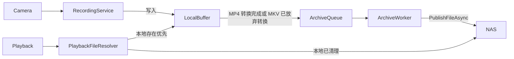
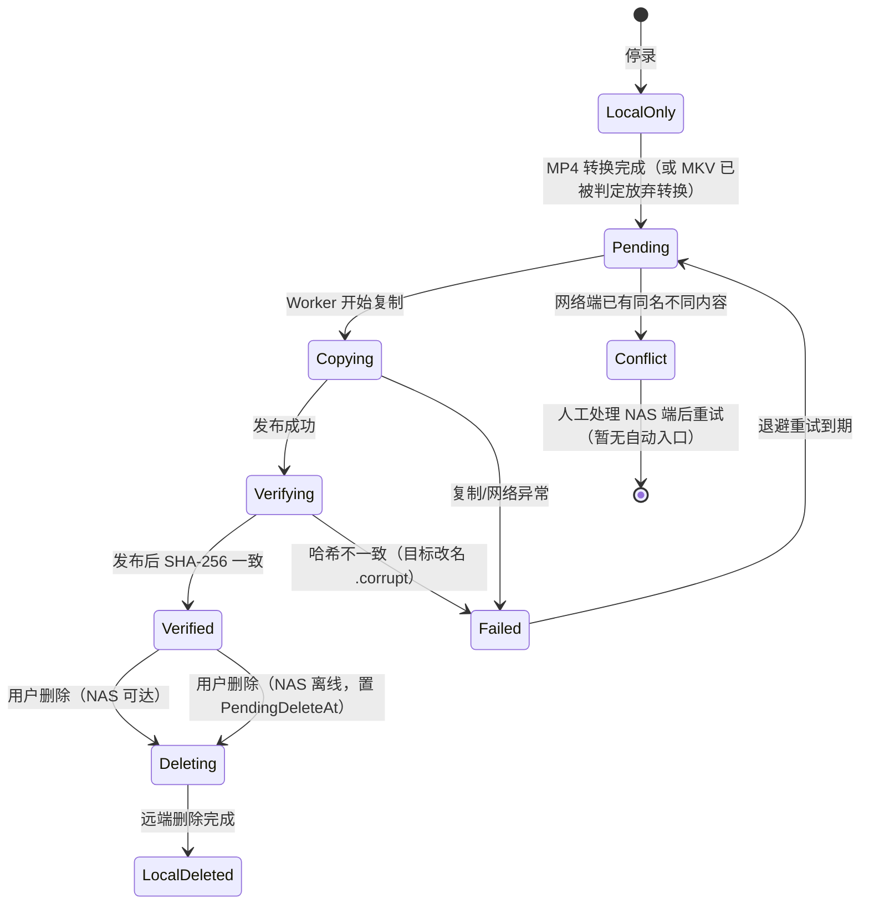
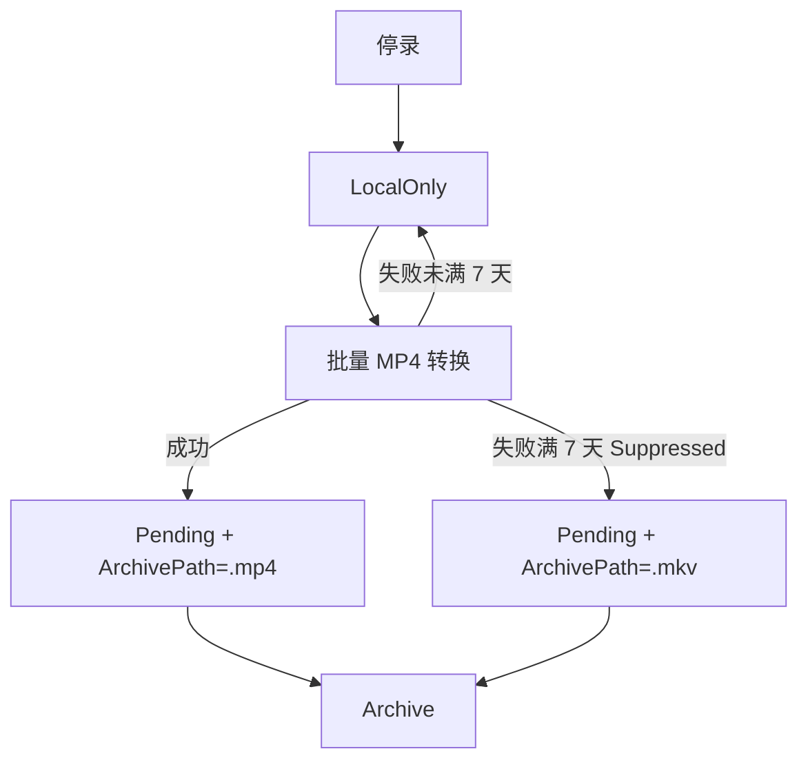
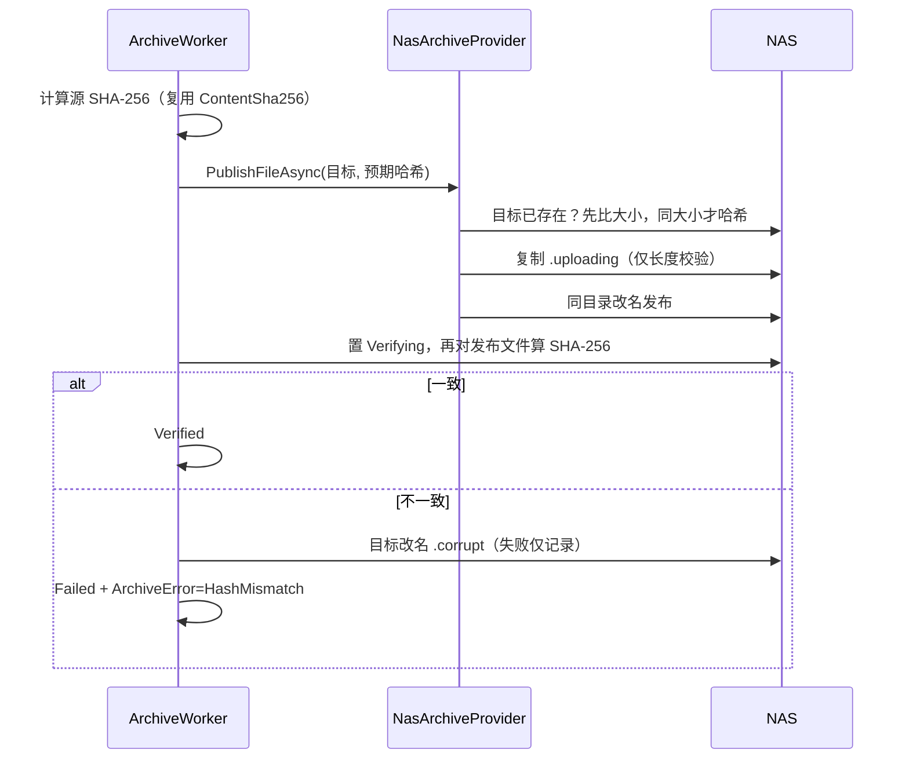

# NAS 双层存储架构说明

本文档描述“本地缓冲 + 网络归档”双层存储的实现边界、状态机与异常流程，供后续维护与贡献者参考。

## 1. 总体模型

- 录像进程只写本机固定盘缓冲（`LocalRecordingBufferPath`），网络路径绝不直接交给录像进程。
- NAS 只作为归档目标；从机/手机上传仍走 HTTP 到主机缓冲，再由归档 Worker 异步复制。
- 默认存储列表只含本地固定磁盘；网络位置必须由用户在“存储管理”手动添加（映射盘保存前归一化为 UNC）。

## 2. 归档状态流转

- `LocalOnly`：录像已停止但尚未决定最终文件，**不进入归档队列**。
- `Pending`：最终文件已确定（MP4 转换成功，或 MKV 被 `MkvConversionRetryPolicy` 判定 Suppressed），等待归档。
- `Copying`/`Verifying`：断点续传优先；`Verifying` 是发布后的后台 SHA-256 校验状态。
- `Conflict`：NAS 已有同名但内容不同的文件，绝不覆盖；本地文件保留供人工比对，硬循环不删除 Conflict。
- `Deleting`：用户删除流程；NAS 离线时写入 `PendingDeleteAt`，Worker 恢复后继续删除远端。

## 3. 数据库字段与队列语义

归档队列 v1 直接使用 `VideoRecords` 上的状态字段（单 NAS 目标够用）：

| 字段 | 语义 |
| --- | --- |
| `ArchivePath` | 网络归档目标完整路径（UNC 优先） |
| `ArchiveStatus` | LocalOnly / Pending / Copying / Verifying / Verified / Failed / Conflict / Deleting / LocalDeleted |
| `ArchiveRetryCount` / `NextRetryAt` | 失败退避（30s×2^n，上限 30 分钟） |
| `ArchiveError` | 最近一次错误（哈希失败为 `HashMismatch`） |
| `ArchiveCompletedAt` | 归档验证完成时间 |
| `PendingDeleteAt` | 用户删除时 NAS 离线，等待恢复继续删除 |
| `LocalCopyDeletedAt` / `LocalDeleteReason` | 本地副本清理时间与原因 |
| `DeleteReasonCode` | `UserRequested` / `CapacityCleanupVerified` / `CapacityEmergencyCleanupUnarchived` |
| `ContentSha256` | 归档校验哈希（发布后写入） |

队列查询：`GetPendingArchives` 按 Copying → Verifying → Pending（新完成优先）→ Failed（到期优先）排序；`GetPendingArchiveDeletes` 处理等待删除项。

未来出现多归档目标（NAS + 云）时，拆独立 `ArchiveQueue` 表并按目标路由，`VideoRecords` 只保留状态摘要。

## 4. MKV/MP4 生命周期

- 转换成功：`UpdateVideoFilePath` 自动把 ArchivePath 从 `.mkv` 换成 `.mp4` 并置 Pending。
- 转换被 `MkvConversionRetryPolicy` 判定 Suppressed（首次失败超过 7 天）：`MarkArchivePendingByFilePath` 把 MKV 置 Pending。
- 正常路径 NAS 上只出现最终文件，不会 MKV/MP4 双份。
- 已知边例：用户手动强制转换（forceRetry）已归档 MKV 时，可能短暂出现 MKV/MP4 双份；不自动清理，需人工处理。
- 未找到 FFmpeg 时不做转换也不归档，记录保持 LocalOnly。

## 5. NAS 异常流程

- **录像中 NAS 离线**：录像继续写入本地缓冲，不受影响；最终文件确定后进入 Pending，等待 Worker 重试。
- **归档中断/程序重启**：状态保留在 DB，重启后从 Copying/Verifying/Pending 继续；残留 `.uploading` 在本地源仍存在时清理。
- **NAS 长时间离线**：记录进入 Failed 退避重试；本地缓冲满时先只删已归档本地副本。
- **硬循环兜底（最后降级策略，不是正常 GC）**：同时满足以下条件才触发——
  1. 一轮正常 GC 后仍无法满足 `StorageSpacePolicy` 保留要求（可用空间低于该卷安全预留值）；
  2. 工作缓冲卷可用空间低于 5 GiB（内部常量 `LocalBufferEmergencyThreshold`）；
  3. 以 3 秒超时探测网络归档目标根不可达（可达则只唤醒归档，不删除）。

  触发后只删除 `EndTime` 超过 30 分钟保护期（`EmergencyDeleteGracePeriod`）且状态为 `LocalOnly/Pending/Failed` 的本地副本，按结束时间最旧优先；每次删除取所有权锁，删除后写 `DeleteReasonCode = CapacityEmergencyCleanupUnarchived` 并弹提示。**Conflict 永不进入硬循环**。

- **用户删除**：本地必删；网络可达则同步删远端并标记记录删除（`UserRequested`）；网络离线则置 `Deleting + PendingDeleteAt`，恢复后由 Worker 完成。

## 6. 归档发布与校验

## 7. 关键常量与配置

- 网络位置预留：至少 10 GB 或总容量 2%（`StorageSpacePolicy`）。
- 本地缓冲保护线：5 GiB、删除保护期 30 分钟（`LocalCopyCleanupPolicy`，不提供 UI 配置）。
- MKV 放弃转换阈值：沿用 `MkvConversionRetryPolicy`（首次失败超过 7 天）。
- 远端探测/操作超时：3 秒（`RemoteFileProbe`、`ArchiveWorkerOptions.RemoteTimeout`）。
